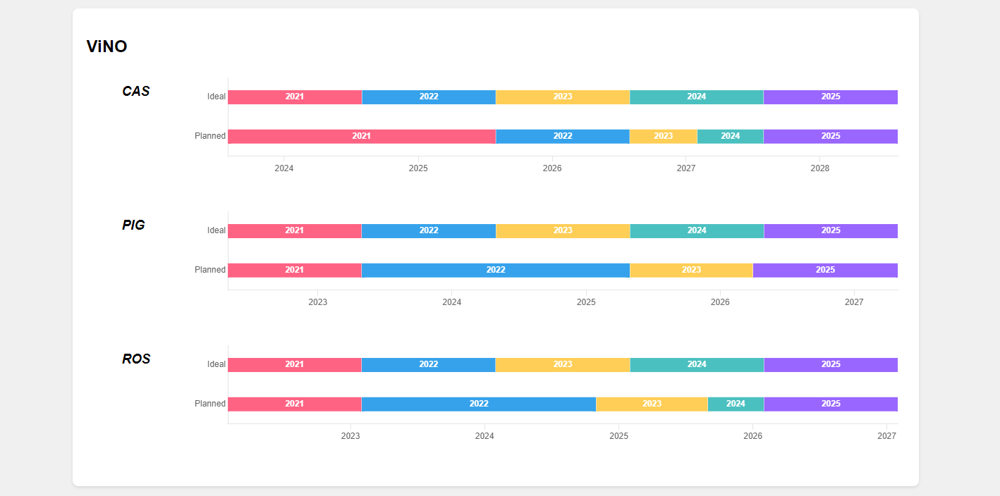

# Wine Vintage Transition Visualization

This project provides a visual tool for winemakers and product managers to compare ideal and planned vintage transition timelines for wine products.



## Features

- Displays ideal and planned vintage transitions on a single timeline
- Supports multiple brands and SKUs

## Getting Started

### Prerequisites

- Node.js (version 12 or later)
- npm (usually comes with Node.js)

### Installation

1. Clone the repository:

   ```
   git clone https://github.com/yourusername/wine-vintage-visualization.git
   ```
2. Navigate to the project directory:

   ```
   cd wine-vintage-visualization
   ```
3. Install dependencies:

   ```
   npm install
   ```

### Running the Application

1. Start the development server:

   ```
   npm start
   ```
2. Open your browser and go to `http://localhost:3000`

## Usage

1. Prepare your data in an Excel file with the following columns:

   - Brand
   - ParentSKU
   - Vintage
   - IVT_Start (Ideal Vintage Transition Start)
   - IVT_End (Ideal Vintage Transition End)
   - VTD_Start (Planned Vintage Transition Start)
   - VTD_End (Planned Vintage Transition End)
2. Place your Excel file in the `public` folder of the project and name it `wine_data.xlsx`.
3. Run the application. It will automatically read the data and generate the visualizations.

## Customization

- To change the color palette, modify the `colorPalette` array in `src/components/Timeline.js`.
- Adjust the chart dimensions by modifying the CSS in `src/components/Timeline.css`.

## License

This project is licensed under the MIT License - see the LICENSE.md file for details.
